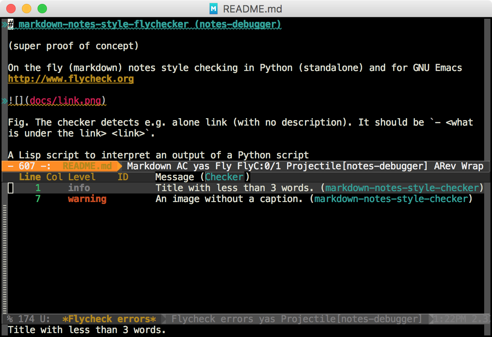

# markdown-notes-style-flychecker (notes-debugger) #

(super proof of concept)

On the fly (markdown) notes style checking in Python (standalone) and for GNU Emacs http://www.flycheck.org


Fig. The checker detects e.g. alone link (with no description). It should be `- <what is under the link> <link>`.

A Lisp script to interpret an output of a Python script `markdown_notes_style_checker.py`:

```shell
markdown_notes_style_checker.py README.md
README.md:1: info: Title with less than 3 words.
README.md:7: warning: An image without a caption.
```
Define new rules in the Python script!
